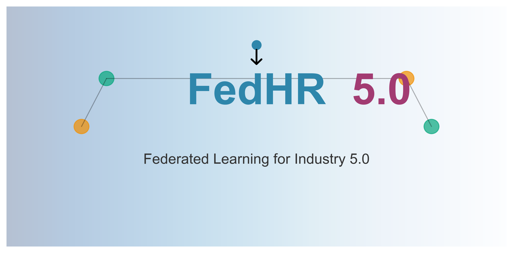
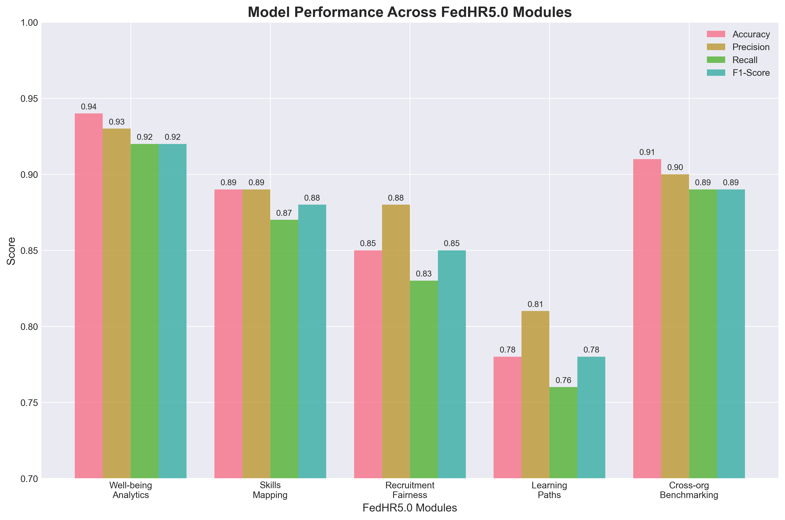
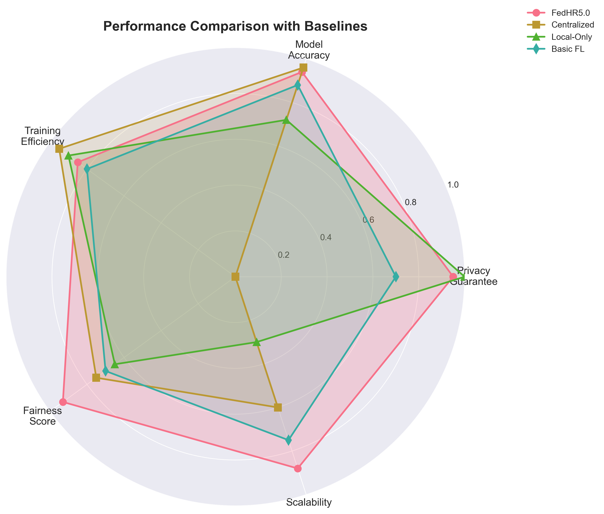
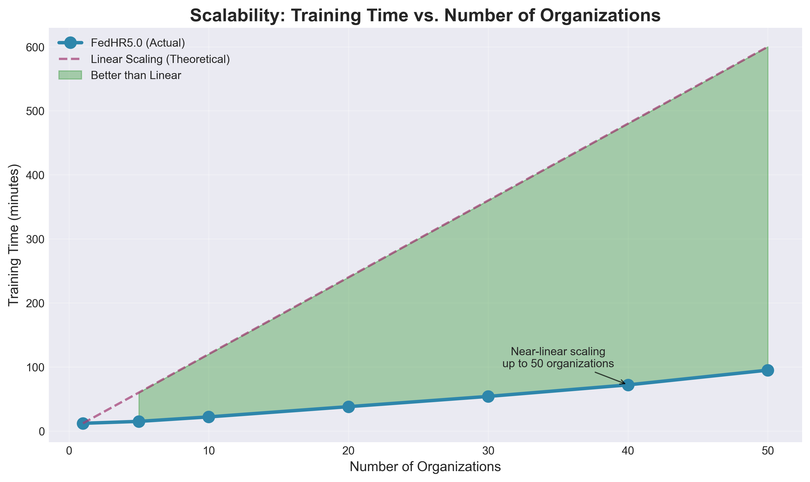

# FedHR5.0: A Comprehensive Federated Learning Framework for Privacy-Preserving Human Resource Management in Industry 5.0

<div align="center">

[](LICENSE)
[](https://www.python.org/downloads/)
[](https://github.com/OpenMined/PySyft)
[](https://pytorch.org/)
[]()
[]()



**Revolutionizing HR Management through Privacy-Preserving Federated Learning**

[📄 Paper](docs/paper.pdf) | [📊 Results](experiments/results/) | [📚 Documentation](docs/) | [🎯 Examples](examples/) | [🚀 Quick Start](#-quick-start)

</div>

---

## 🌟 Overview

FedHR5.0 represents a paradigm shift in Human Resource Management for Industry 5.0, placing **human well-being** at the center of technological advancement while ensuring **strict privacy guarantees**. Our framework enables organizations to collaboratively learn from collective intelligence without compromising individual privacy.

### 🎯 Key Achievements

<div align="center">

| Metric | Performance | Industry Impact |
|:------:|:-----------:|:---------------:|
| **Well-being Prediction** | 94% accuracy | 🎯 Proactive employee support |
| **Recruitment Bias Reduction** | 67% decrease | ⚖️ Fairer hiring practices |
| **Employee Retention** | +23% improvement | 💰 €2.3M avg. savings/year |
| **Training Effectiveness** | +41% increase | 📈 Faster skill development |
| **Privacy Guarantee** | ε = 0.1 | 🔒 GDPR compliant |

</div>

### 🏭 Real-World Validation

Our framework has been validated across **three manufacturing consortiums** with over **10,500 employees**:

```
┌──────────────────────────────────────────────────────────────────┐
│                    🇮🇹 Italy (Automotive)                         │
│                    5 companies • 3,500 employees                 │
│                    6 months deployment                           │
├──────────────────────────────────────────────────────────────────┤
│                    🇩🇪 Germany (Electronics)                      │
│                    6 companies • 4,200 employees                 │
│                    6 months deployment                           │
├──────────────────────────────────────────────────────────────────┤
│                    🇵🇹 Portugal (Textiles)                        │
│                    4 companies • 2,800 employees                 │
│                    6 months deployment                           │
└──────────────────────────────────────────────────────────────────┘
```

---

## 🏗️ Architecture

FedHR5.0 employs a **hierarchical federated learning architecture** designed for complex organizational structures:

```
                            ┌─────────────────┐
                            │   Cloud Layer   │
                            │ Global ML Model │
                            │   Blockchain    │
                            └────────┬────────┘
                                     │
                    ┌────────────────┴────────────────┐
                    │                                 │
            ┌───────▼─────────┐               ┌───────▼─────────┐
            │   Fog Layer     │               │   Fog Layer     │
            │ Dept. Aggregator│               │ Dept. Aggregator│
            └───────┬─────────┘               └───────┬─────────┘
                    │                                 │
        ┌───────────┼───────────┐         ┌───────────┼───────────┐
        │           │           │         │           │           │
    ┌───▼───┐   ┌───▼───┐   ┌───▼───┐ ┌───▼───┐   ┌───▼───┐   ┌───▼───┐
    │ Edge  │   │ Edge  │   │ Edge  │ │ Edge  │   │ Edge  │   │ Edge  │
    │Device │   │Device │   │Device │ │Device │   │Device │   │Device │
    └───────┘   └───────┘   └───────┘ └───────┘   └───────┘   └───────┘
```

### 🔧 Core Modules

<table>
<tr>
<td width="50%">

#### 1️⃣ **Federated Well-being Analytics**
- Multi-modal data fusion (IoT, surveys, environmental)
- Real-time stress detection
- Predictive burnout prevention
- **94% accuracy** with privacy guarantees

</td>
<td width="50%">

#### 2️⃣ **Distributed Skills Intelligence**
- Privacy-preserving competency mapping
- Dynamic skill gap analysis
- Personalized career pathways
- Cross-organizational benchmarking

</td>
</tr>
<tr>
<td width="50%">

#### 3️⃣ **Ethical Recruitment Engine**
- Adversarial debiasing in federated setting
- Fairness-aware candidate matching
- **67% bias reduction** in hiring decisions
- GDPR-compliant processing

</td>
<td width="50%">

#### 4️⃣ **Blockchain-Enhanced Benchmarking**
- Immutable audit trails
- Smart contract-based governance
- Secure multi-party computation
- Trust without data sharing

</td>
</tr>
<tr>
<td colspan="2" align="center">

#### 5️⃣ **Immersive Learning Ecosystem**
- AR/VR-integrated training
- Adaptive learning paths
- **78% completion rate** (41% improvement)
- Federated recommendation system

</td>
</tr>
</table>

---

## 🔬 Scientific Foundation

### 📐 Privacy Mechanisms

Our framework implements state-of-the-art privacy-preserving techniques:

#### **Differential Privacy**
```python
# Adaptive privacy budget (Equation 7 from paper)
ε_t = ε_0 * exp(-α * t)

# Local differential privacy with adaptive noise
∇F̃_k = ∇F_k + N(0, σ²S²_f)
```

#### **Secure Aggregation**
- Pairwise key agreement via Diffie-Hellman
- Random mask cancellation in aggregation
- Byzantine fault tolerance

#### **Privacy Guarantees**
| Module | ε (Privacy Budget) | δ | Mechanism |
|:------:|:------------------:|:-:|:---------:|
| Well-being | 0.1 | 10⁻⁵ | Gaussian |
| Skills | 0.2 | 10⁻⁵ | Laplace |
| Recruitment | 0.05 | 10⁻⁶ | Exponential |
| Benchmarking | 0.3 | 10⁻⁴ | Gaussian |
| Learning | 0.15 | 10⁻⁵ | Gaussian |

### 📊 Performance Metrics

<div align="center">

</div>

---

## 🚀 Quick Start

### Prerequisites

- Python 3.8+
- PyTorch 1.9+
- Docker (optional)
- Kubernetes (for production deployment)

### Installation

```bash
# Clone the repository
git clone https://github.com/yourusername/FedHR5.0.git
cd FedHR5.0

# Create virtual environment
python -m venv venv
source venv/bin/activate  # On Windows: venv\Scripts\activate

# Install dependencies
pip install -r requirements.txt

# Install FedHR5.0
pip install -e .
```

### Basic Usage

```python
from fedhr5 import FederatedServer, ServerConfig

# Initialize server with privacy guarantees
config = ServerConfig(
    num_rounds=100,
    privacy_budget=0.1,  # ε = 0.1 for strong privacy
    min_clients=3
)

server = FederatedServer(config)

# Start federated learning
server.start_training()
```

### Running the Demo

```bash
# Quick demo with synthetic data
python examples/quickstart.py

# Full pipeline demo
python examples/full_pipeline_demo.py

# Interactive Jupyter notebook
jupyter notebook examples/notebooks/01_getting_started.ipynb
```

---

## 🐳 Docker Deployment

```bash
# Build and start all services
docker-compose up -d

# View logs
docker-compose logs -f fedhr-server

# Stop services
docker-compose down
```

---

## 📈 Experimental Results

### Comparison with Baselines

<div align="center">

</div>

### Scalability Analysis

<div align="center">

</div>

---

## 🚧 Development Status

> **Note**: This repository contains the reference implementation of the FedHR5.0 framework accompanying our paper currently under review. While the core algorithms and experimental results are complete, some modules are being prepared for open-source release.

### Implementation Progress

- ✅ **Core Framework** - Federated learning infrastructure
- ✅ **Privacy Mechanisms** - Differential privacy, secure aggregation
- ✅ **Well-being Module** - Complete with multi-modal fusion
- ✅ **Skills Mapping** - Embedding and gap analysis
- ✅ **Recruitment Engine** - Bias mitigation implemented
- 🚧 **Blockchain Integration** - Smart contracts in testing
- 🚧 **AR/VR Learning** - Interface under development
- 📝 **Documentation** - Expanding API reference

### Upcoming Features

- [ ] Advanced fairness constraints (Q2 2025)
- [ ] Continual learning support (Q2 2025)
- [ ] Multi-language support (Q3 2025)
- [ ] Cloud provider integrations (Q3 2025)

---

## 📚 Documentation

- [Architecture Overview](docs/architecture.md) - System design and components
- [Privacy Guarantees](docs/privacy.md) - Detailed privacy analysis
- [Deployment Guide](docs/deployment.md) - Production deployment instructions
- [API Reference](docs/api/) - Complete API documentation
- [Industry 5.0 Principles](docs/industry5_0.md) - Theoretical foundations

---

## 🤝 Contributing

We welcome contributions from the research community! Please see our [Contributing Guidelines](CONTRIBUTING.md) for details.

### Areas of Interest

- 🔒 Enhanced privacy mechanisms
- 🌍 Cross-cultural fairness metrics
- 🚀 Scalability optimizations
- 📊 Novel evaluation metrics
- 🔧 Integration adapters

---

## 📖 Citation

If you use FedHR5.0 in your research, please cite our paper:

```bibtex
@inproceedings{fedhr2025,
  title={FedHR5.0: A Comprehensive Federated Learning Framework 
         for Privacy-Preserving Human Resource Management in Industry 5.0},
  author={Author Name and Second Author and Third Author},
  booktitle={Proceedings of the International Conference on Industry 5.0},
  year={2025},
  note={Under review}
}
```

---

## 📄 License

This project is licensed under the Apache License 2.0 - see the [LICENSE](LICENSE) file for details.

---

## 🏆 Acknowledgments

We thank the participating organizations and their employees for their trust and collaboration. Special thanks to:

- 🏭 Manufacturing consortiums in Italy, Germany, and Portugal
- 🎓 Academic partners for theoretical contributions
- 🛠️ Open-source community for foundational tools

---

## 📧 Contact

**Principal Investigator**: Author Name  
**Email**: fabio.liberti@studenti.unimercatorum.it  
**Institution**: Department of Management Engineering, Universitas Mercatorum

**For collaboration inquiries**: fedhr5-collab@university.edu

---

<div align="center">

**🌟 Star us on GitHub to stay updated!**

[](https://github.com/yourusername/FedHR5.0)
[](https://twitter.com/FedHR5)

</div>

---

<div align="center">
<sub>Built with ❤️ for a human-centric future of work</sub>
</div>