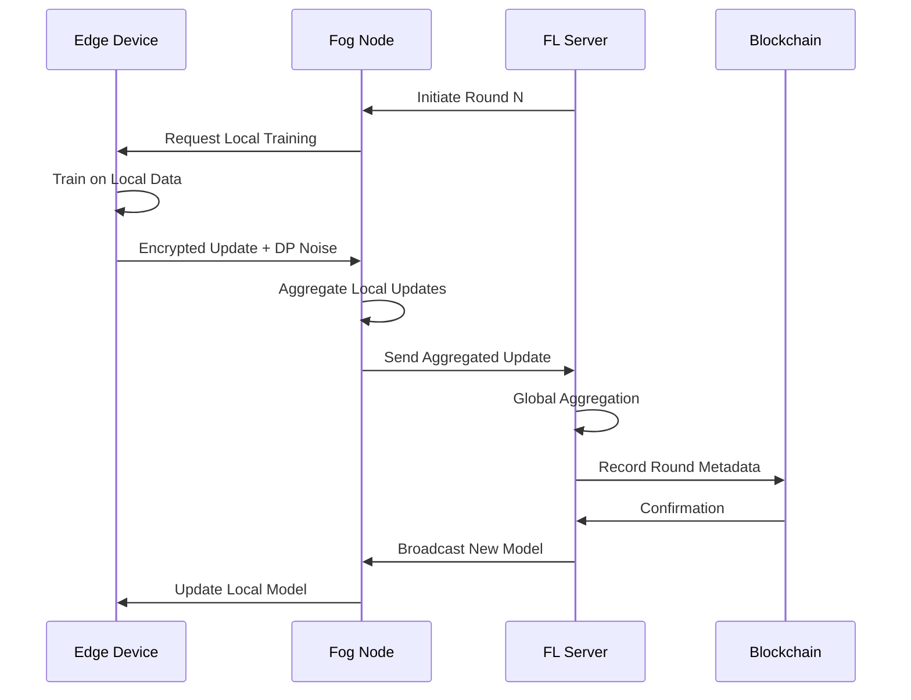

# FedHR5.0 Architecture Overview

> System design and components for privacy-preserving HR management in Industry 5.0

## Table of Contents

1. [Overview](#overview)
2. [System Architecture](#system-architecture)
3. [Core Components](#core-components)
4. [Communication Protocol](#communication-protocol)
5. [Data Flow](#data-flow)
6. [Security Layers](#security-layers)
7. [Scalability Design](#scalability-design)
8. [Technology Stack](#technology-stack)

## Overview

FedHR5.0 implements a **hierarchical federated learning architecture** designed to accommodate the complex organizational structures typical in manufacturing consortiums. The system ensures privacy-preserving analytics while enabling cross-organizational collaboration.

### Design Principles

- **Privacy-First**: All data remains on-premise, only encrypted model updates are shared
- **Human-Centric**: Designed around employee well-being and empowerment
- **Scalable**: Supports 1 to 100+ organizations
- **Resilient**: Byzantine fault-tolerant with automatic failover
- **Sustainable**: Optimized for minimal computational footprint

## System Architecture

### Three-Layer Hierarchy

```
┌─────────────────────────────────────────────────────┐
│                   CLOUD LAYER                       │
│  • Global Model Coordination                        │
│  • Blockchain Governance                            │
│  • Cross-Consortium Analytics                       │
└──────────────────────┬──────────────────────────────┘
                       │
┌──────────────────────┴──────────────────────────────┐
│                    FOG LAYER                        │
│  • Department/Facility Aggregation                  │
│  • Local Model Training                             │
│  • Privacy-Preserving Aggregation                   │
└──────────────────────┬──────────────────────────────┘
                       │
┌──────────────────────┴──────────────────────────────┐
│                   EDGE LAYER                        │
│  • IoT Sensors & Devices                            │
│  • Employee Interfaces                              │
│  • Real-time Data Collection                        │
└─────────────────────────────────────────────────────┘
```

### Layer Responsibilities

#### Cloud Layer
- **Global Model Management**: Maintains the consortium-wide global model
- **Blockchain Integration**: Immutable audit trails and smart contracts
- **Privacy Budget Tracking**: Monitors cumulative privacy expenditure
- **Performance Monitoring**: Real-time dashboards and alerts

#### Fog Layer
- **Local Aggregation**: Combines updates from edge devices
- **Differential Privacy**: Adds calibrated noise to updates
- **Compression**: Reduces communication overhead
- **Caching**: Stores intermediate results

#### Edge Layer
- **Data Collection**: Gathers multimodal employee data
- **Local Training**: Performs on-device model updates
- **Encryption**: Secures data before transmission
- **User Interface**: Provides feedback to employees

## Core Components

### 1. Federated Server

```python
class FederatedServer:
    """
    Central coordination server implementing FedAvg with privacy guarantees.
    
    Key responsibilities:
    - Client registration and authentication
    - Round orchestration
    - Model aggregation with differential privacy
    - Blockchain integration
    """
```

**Key Features:**
- Asynchronous client handling
- Adaptive aggregation strategies
- Privacy budget management
- Fairness constraint enforcement

### 2. Federated Client

```python
class FederatedClient:
    """
    Organization-level client for local training.
    
    Key responsibilities:
    - Local data management
    - Model training
    - Update encryption
    - Communication with server
    """
```

**Key Features:**
- Multi-modal data fusion
- Heterogeneous data handling
- Secure update transmission
- Local privacy preservation

### 3. Privacy Engine

```python
class PrivacyEngine:
    """
    Implements differential privacy mechanisms.
    
    Mechanisms:
    - Gaussian mechanism for gradients
    - Adaptive noise calibration
    - Privacy composition tracking
    - Budget allocation strategies
    """
```

**Privacy Guarantees:**
- ε = 0.1 (strong privacy)
- δ = 10⁻⁵
- Adaptive budget allocation
- Per-round and cumulative tracking

### 4. Blockchain Manager

```python
class BlockchainManager:
    """
    Hyperledger Fabric integration for trust and transparency.
    
    Features:
    - Smart contract deployment
    - Transaction management
    - Consensus participation
    - Audit trail creation
    """
```

**Smart Contracts:**
- Model update validation
- Privacy budget enforcement
- Incentive distribution
- Access control

### 5. Module Orchestrator

```python
class ModuleOrchestrator:
    """
    Coordinates the five core FedHR5.0 modules.
    
    Modules:
    1. Well-being Analytics
    2. Skills Intelligence
    3. Ethical Recruitment
    4. Cross-org Benchmarking
    5. Immersive Learning
    """
```

## Communication Protocol

### gRPC-based Protocol Stack

```
┌─────────────────────────┐
│   Application Layer     │  ← FedHR5.0 Protocol
├─────────────────────────┤
│   Encryption Layer      │  ← TLS 1.3 + Additional
├─────────────────────────┤
│   Serialization Layer   │  ← Protocol Buffers
├─────────────────────────┤
│   Transport Layer       │  ← gRPC over HTTP/2
└─────────────────────────┘
```

### Message Types

1. **Registration Messages**
   ```protobuf
   message ClientRegistration {
     string client_id = 1;
     string organization_name = 2;
     int32 num_employees = 3;
     repeated string capabilities = 4;
   }
   ```

2. **Training Messages**
   ```protobuf
   message ModelUpdate {
     string round_id = 1;
     bytes encrypted_gradients = 2;
     float privacy_spent = 3;
     map<string, float> metrics = 4;
   }
   ```

3. **Aggregation Messages**
   ```protobuf
   message AggregatedModel {
     string round_id = 1;
     bytes global_weights = 2;
     float total_privacy_spent = 3;
     FairnessMetrics fairness = 4;
   }
   ```

## Data Flow

### Training Round Lifecycle



### Privacy-Preserving Data Flow

1. **Data Never Leaves Premises**: Raw employee data remains on edge devices
2. **Encrypted Updates Only**: All communications use end-to-end encryption
3. **Differential Privacy**: Noise added at source before aggregation
4. **Secure Aggregation**: Server never sees individual updates

## Security Layers

### Defense in Depth Strategy

1. **Network Security**
   - VPN tunnels between organizations
   - Firewall rules and intrusion detection
   - DDoS protection

2. **Application Security**
   - OAuth 2.0 authentication
   - Role-based access control (RBAC)
   - API rate limiting

3. **Data Security**
   - AES-256 encryption at rest
   - TLS 1.3 in transit
   - Homomorphic encryption (experimental)

4. **Privacy Protection**
   - Differential privacy (ε = 0.1)
   - Secure multi-party computation
   - K-anonymity enforcement

## Scalability Design

### Horizontal Scaling

```yaml
# Kubernetes Horizontal Pod Autoscaler
apiVersion: autoscaling/v2
kind: HorizontalPodAutoscaler
metadata:
  name: fedhr-server-hpa
spec:
  scaleTargetRef:
    apiVersion: apps/v1
    kind: Deployment
    name: fedhr-server
  minReplicas: 3
  maxReplicas: 100
  metrics:
  - type: Resource
    resource:
      name: cpu
      target:
        type: Utilization
        averageUtilization: 70
```

### Performance Optimizations

1. **Gradient Compression**
   - Top-K sparsification
   - Quantization to 8-bit
   - Delta encoding

2. **Asynchronous Updates**
   - Non-blocking client updates
   - Bounded staleness
   - Adaptive synchronization

3. **Caching Strategy**
   - Redis for model caching
   - CDN for static resources
   - Edge caching for frequently accessed data

## Technology Stack

### Core Technologies

| Component | Technology | Version | Purpose |
|-----------|------------|---------|---------|
| ML Framework | PyTorch | 1.9+ | Neural network training |
| FL Framework | PySyft | 0.8.0 | Federated learning |
| Communication | gRPC | 1.38+ | RPC framework |
| Blockchain | Hyperledger Fabric | 2.4 | Distributed ledger |
| Container | Docker | 20.10+ | Containerization |
| Orchestration | Kubernetes | 1.21+ | Container orchestration |
| Monitoring | Prometheus | 2.30+ | Metrics collection |
| Visualization | Grafana | 8.0+ | Dashboards |

### Programming Languages

- **Python 3.9+**: Core ML/FL implementation
- **Go**: High-performance components
- **Solidity**: Smart contracts
- **TypeScript**: Web interfaces
- **Rust**: Critical privacy components

### Databases

- **PostgreSQL**: Metadata storage
- **TimescaleDB**: Time-series metrics
- **Redis**: Caching layer
- **IPFS**: Distributed model storage

## Deployment Configurations

### Minimum Requirements

```yaml
# Edge Device
cpu: 2 cores
memory: 4GB
storage: 50GB
network: 10 Mbps

# Fog Node
cpu: 8 cores
memory: 32GB
storage: 500GB
network: 100 Mbps

# Cloud Server
cpu: 16 cores
memory: 64GB
storage: 2TB
network: 1 Gbps
```

### Recommended Production Setup

```yaml
# High Availability Configuration
servers:
  cloud: 3 (different regions)
  fog: 2 per facility
  edge: 1 per 50 employees

redundancy:
  level: N+2
  backup: Real-time replication
  disaster_recovery: 4-hour RTO
```

## Future Architecture Enhancements

### Planned Improvements (Q2-Q3 2025)

1. **Quantum-Resistant Cryptography**
   - Post-quantum key exchange
   - Lattice-based encryption

2. **Edge AI Acceleration**
   - TPU/GPU support
   - Model quantization
   - Neural architecture search

3. **5G Integration**
   - Ultra-low latency communication
   - Network slicing
   - Edge computing optimization

4. **Advanced Privacy**
   - Fully homomorphic encryption
   - Secure enclaves
   - Zero-knowledge proofs

## References

1. McMahan, B., et al. (2017). "Communication-Efficient Learning of Deep Networks from Decentralized Data"
2. Dwork, C., & Roth, A. (2014). "The Algorithmic Foundations of Differential Privacy"
3. Industry 5.0 EU Commission Report (2021)

---

*Last Updated: December 2024*
*Version: 0.1.0*